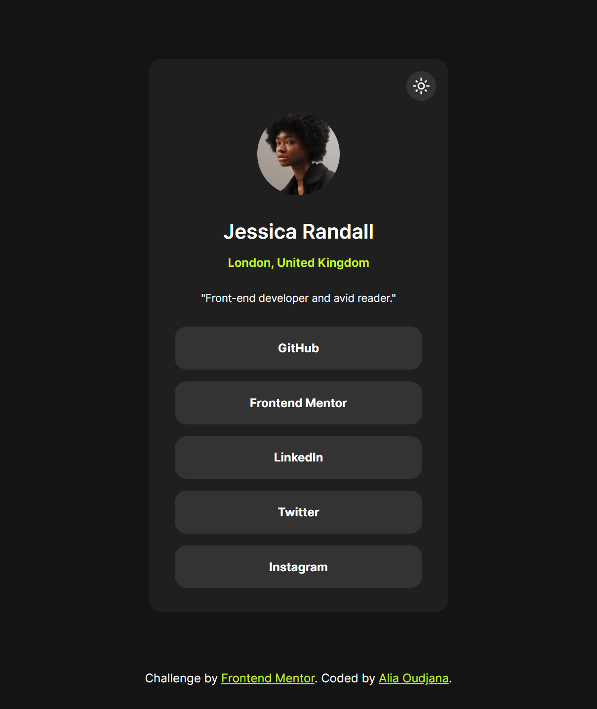
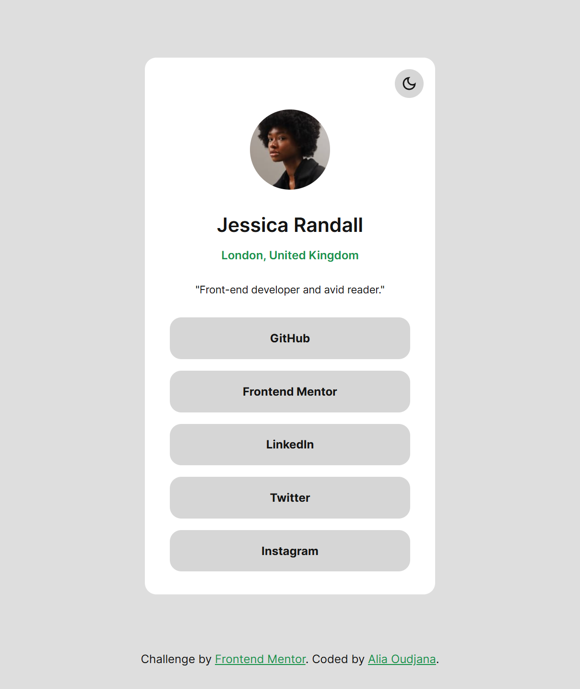

# Social links profile with light/dark themes

This is a solution to the [Social links profile challenge on Frontend Mentor](https://www.frontendmentor.io/challenges/social-links-profile-UG32l9m6dQ).

## Table of contents

- [Overview](#overview)
  - [The challenge](#the-challenge)
  - [Screenshot](#screenshot)
  - [Links](#links)
  - [Built with](#built-with)
- [Author](#author)

## Overview

### The challenge

Users should be able to:

- See hover and focus states for all interactive elements on the page

Extra (added by me):

- View the optimal size for the component depending on their device's screen size
- Switch between light and dark themes
- Control the theme switch with both their mouse/trackpad and their keyboard

### Screenshot

### Links

- Solution URL: https://github.com/AliaOudjana/Social-links-profile
- Live Site URL: https://aliaoudjana.github.io/Social-links-profile/

### Built with

- Semantic HTML5 markup
- SASS
- Flexbox
- JavaScript
- Mobile-first workflow

## Author

- Frontend Mentor - [@AliaOudjana](https://www.frontendmentor.io/profile/AliaOudjana)
- LinkedIn - [@Alia-Oudjana](https://www.linkedin.com/in/alia-oudjana/)